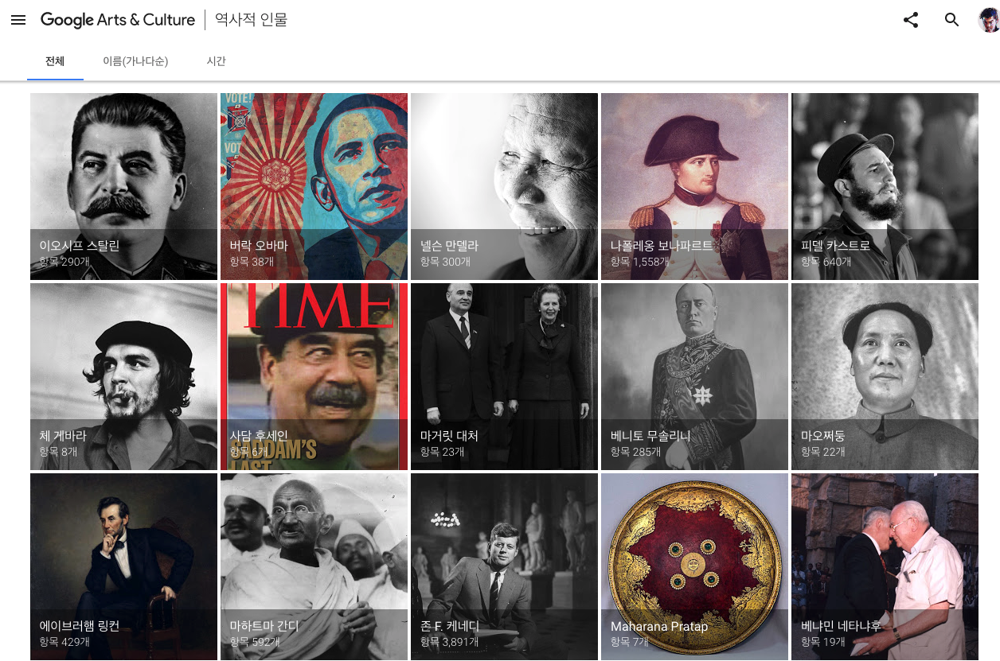
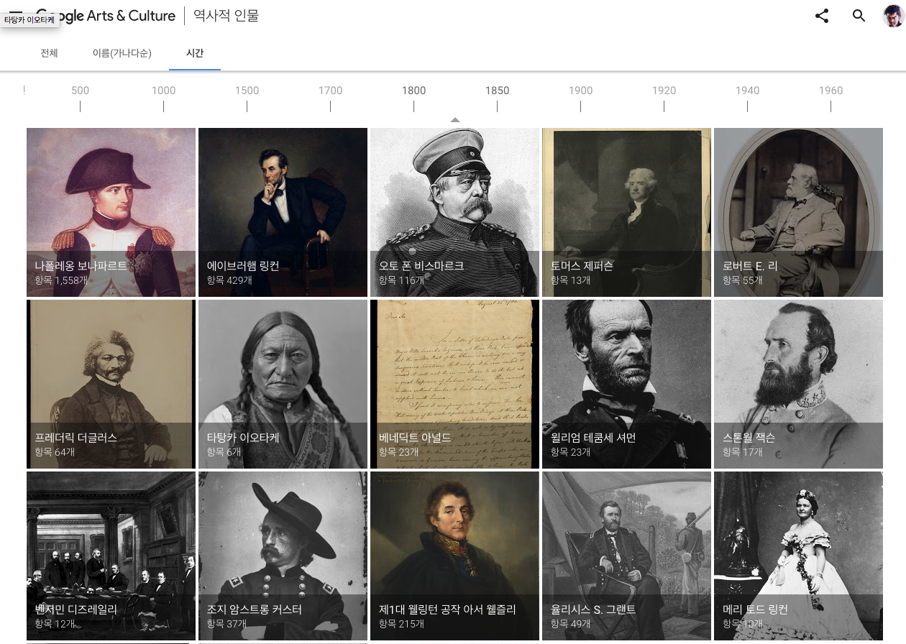
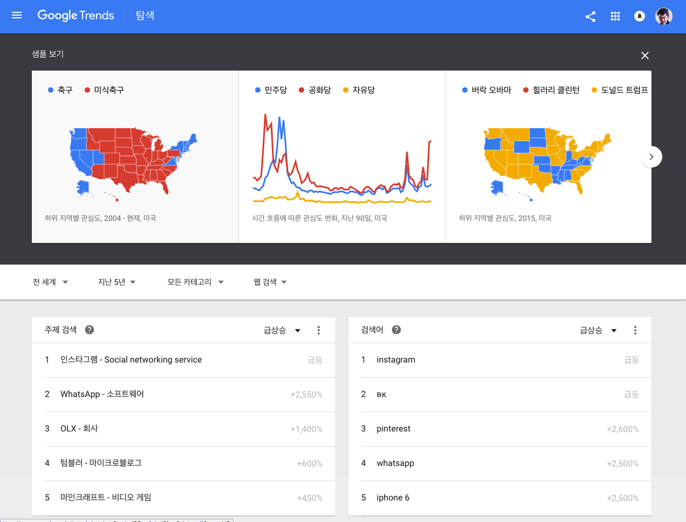

# STUCKYI STUDIO SMALL PROJECT
---
- 2016. 10. 5~

<br/><br/><br/> 
 ## 진행과정에서 알게된 것 & 복습하는 것 들
---

<br/><br/><br/> 

 ## libraries
---
- d3.js
  - [d3.js Webpage](https://www.d3js.org)
  - [d3.js npm](https://www.npmjs.com/package/d3)
  - [d3.js cdn](https://cdnjs.cloudflare.com/ajax/libs/d3/4.2.6/d3.min.js)

- leaflet.js & css
  - [leaflet.js Webpage](http://leafletjs.com/)
  - [leaflet.js tutorial](http://leafletjs.com/examples/quick-start/example.html)
  - [leaflet.js cdn](https://cdnjs.cloudflare.com/ajax/libs/leaflet/1.0.1/leaflet.js)
  - [leaflet.css cdn](https://cdnjs.cloudflare.com/ajax/libs/leaflet/1.0.1/leaflet.js)


<br/><br/><br/> 
 ## 참고사이트
---
<br/><br/><br/> 
 ### 콘텐츠 관련 정보 수집 사이트
- [해양수산부 세월호 관련 페이지](http://www.mof.go.kr/article/list.do?menuKey=319&boardKey=21)
  - 세월호 관련 조치사항에 대해 정리해둔 사이트

- [나무위키 - 청해진해운 세월호 침몰 사고](https://namu.wiki/w/%EC%B2%AD%ED%95%B4%EC%A7%84%ED%95%B4%EC%9A%B4%20%EC%84%B8%EC%9B%94%ED%98%B8%20%EC%B9%A8%EB%AA%B0%20%EC%82%AC%EA%B3%A0)

- [한국일보, 세월호 정부시행령 폐기촉구 선언 문화예술인명단](http://www.hankookilbo.com/v/0abb634242a64afca79799b09f8564f4)
  - ['세월호 정부 시행령 폐기 촉구 선언'에 서명한 문화인 594명 명단](http://www.hankookilbo.com/v/41c20368edff4c1f99096bd448561a3e)
  - ['세월호 정부 시행령 폐기 촉구 선언'에 서명한 문화인 754명 명단](http://www.hankookilbo.com/v/146abf21618f42c5ab80bfe37a521e8a)
  - ['문재인 후보 지지선언'에 참여한 예술인 6,517명 (2012년)](http://www.hankookilbo.com/v/0e6921fc482c4d02b7ec5b1618ce3a56)
  - ['박원순 후보 지지 선언'에 참여한 예술인 1,608명 (2014년)](http://www.hankookilbo.com/v/a857d8a53efe4418975e25fc88d8a7e8)


<br/><br/><br/> 
 ### 콘텐츠 형태 참고
- [Google Arts & Culture](https://www.google.com/culturalinstitute/beta/?hl=ko) 
  - Google Cultural Institute와 제휴한 1,000여 곳의 주요 박물관과 자료실의 콘텐츠 등 전 세계의 소중한 자료를 온라인에서 제공
  - `역사적인물 - 시간`탭에서는 그리드와 함께 Timeline형태로 프로젝트를 제작

- [Atlas](https://www.theatlas.com/charts/4JwlhEPEg)
  - 특정 주제에 대한 인사이트를 간략하게 제시하는 차트를 그리드 형태로 제공
  - 사용자가 공유할 수 있는 다양한 기능을 같이 제공
    - Download Image
    - Download Data
    - Embed chart
    - SNS Share (Facebook, Twitter, Email, Pinterest)

- [블로터, 갤럭시노트7 폭발 타임라인 기사](http://www.bloter.net/archives/265136)
  - 미디어에서 어떻게 타임라인형태로 정보를 편집하여 독자에게 전달하는지 볼 수 있다.
  - 관련자료 선별 및 하이퍼링크 추가, 이미지 포함가능 여부등이 중요해보인다.
  - 8월, 9월, 10월 등으로 해당 시점으로 이동하는 기능이 있다.
  - 스크롤을 통해 아래로 전개하는 방식이다.


<br/><br/><br/> 
 ## 관련 사례 리서치
---
<br/><br/><br/> 
 ### 국내사례

<br/><br/><br/> 
 ##<br/><br/><br/> 
 ## Interactive Contents
- [허핑턴포스트, 세월호 6개월, 다시 봐야할 인터랙티브 기사 4개](http://www.huffingtonpost.kr/2014/10/16/story_n_5994648.html)
  - 세월호 관련 인터랙티브기사 4개의 링크와 간략한 설명이 포함된 기사.

- [한겨레 : 사월,애(哀) - 세월호 최초 100시간의 기록](http://www.hani.co.kr/interactive/sewol/index.html)
  - 타임라인 형태의 기사
    - 1~2분 단위로 나뉘어 제공된다.
    - 선박, 직원, 승객, 안행부, 제주V, 진도V, 해경, 해수부, 국방부, 민간, 교육부, 청와대, 총리실, 정치권, 수사, 언론, 가족 으로 분류하고 다른 색상 사용
  - 정리된 데이터 확보가능 여부 및 출처
  - 해당 인터랙티브 기사의 발행 후 피드백 & 사용자 의견 수집
  - 기타 피드백
    - 타임라인 형식은 좋으나, 정보의 위계가 없어 호기심을 가지고 내리다가 어느 순간부터는 쭉쭉 읽지 않고 내려보게된다.

> 허핑턴포스트 : 한겨레는 사고 발생 최초 100시간의 기록을 종합했다. “11개 정부 기관의 보고서와 녹취록 전문, 공소장과 브리핑 자료 20건, 한겨레 기자들의 현장 취재메모 220건, 30개 언론사의 기사와 그래픽 66건”을 비교·대조해가며 정리한 자료다.1. 달아난 골든타임, 2. 콘트롤타워 실종, 3. 애원이 분노로, 4. 청와대로 가자 등의 순서로 정리된 이 기록에는 급박했던 사고 당시 상황과 무능하기만 했던 정부의 대응이 오롯이 담겨있다. 

- [오마이뉴스 : 4월16일, 세월호 – 죽은 자의 기록 산 자의 증언](http://www.ohmynews.com/NWS_Web/Event/sewol_angle.aspx) 
  - 특징
    - 공간의 재구성, 각도의 재구성, 시간의 재구성1, 시간의 재구성2로 나눔
      - 공간의 재구성 : 세월호 전개도를 놓고 사용자에게 세월호의 구조를 보여준다.
      - 각도의 재구성 : 세월호의 구조도를 놓고 시간에 따라 `합동수사본부 경사도 분석`내용에 따라 경사를 변경하여 보여준다. 옆에는 해당 시점에서 이루어진 내용에 대해 다룬다.
      - 시간의 재구성1 (출항부터 침몰까지) : 
        - 타임라인 형태이며 좌우로 이동바를 통해 시점을 이동한다.
        - 콘텐츠 내부에는 관련기사링크를 통해 해당시점에서의 이슈를 소개한다.
          - '기사의 재활용'이라는 점에서 의미가 있을 수도.
      - 시간의 재구성2 (침몰 이후) : (시간의 재구성 1과 동일한 형태)
    - 소셜기능
      - 모든 콘텐츠는 소셜댓글을 작성할 수 있는 영역을 화면 하단에 포함하고 있음
      - 페이스북, 트위터 공유 기능

> 허핑턴 포스트 : 오마이뉴스는 네 가지 항목으로 나눠 세월호의 기록을 정리했다. ‘공간의 재구성’은 생존자의 증언을 바탕으로 침몰 당시의 상황을 기록한 자료다. 배 곳곳에서 무슨 일이 벌어지고 있었는지 볼 수 있다. 오마이뉴스는 3주 동안 만난 생존자 17명의 증언과 재판에서 흘러나온 증언들을 종합해 이를 세월호 도면 위에 펼쳐보였다.‘각도의 재구성’에서는 세월호가 어떻게 침몰해갔는지 확인할 수 있다. 검·경합동수사본부가 작성한 공소장을 기반으로 제작됐다. 오마이뉴스에 따르면, 결과적으로 이 작업은 ‘골든타임의 재구성’이 됐다.‘사건의 재구성 I’과 ‘사건의 재구성 II’는 출항부터 침몰까지, 그리고 침몰 이후의 사건들을 타임라인으로 정리한 메뉴다. 세월호가 어떻게 침몰해갔는지, 또 우리 사회가 어떻게 세월호 참사를 대해왔는지 적나라하게 담겨있다.
    
- [KBS, 100일간 드러난 참사 그 날의 진실](http://www.tiki-toki.com/timeline/entry/310337/100-/#vars!date=2014-04-16_08:16:47!)
  - 특징
    - 자체 개발이라기보다는 [tiki-toki](http://www.tiki-toki.com/)라는 타임라인 제작 서비스를 활용했다.
    - 3D형태로 앞으로 나아가면서 상단의 시간과 매칭되는 기사나, 관련 정보들을 탐색할 수 있도록 했으며, 하단에는 전형적인 타임라인 형태의 시각화 표현이 있음.


> 허핑턴포스트 : KBS는 세월호 참사 100일을 맞아 참사 당일의 기록들을 3D 인터랙티브 기사로 정리했다. 세월호 선체, 구조 수색작업, 그리고 청와대와 정부가 사고 당일 각각 어떻게 움직였는지 확인할 수 있다.가라앉는 배 안에서 단원고 학생들이 다급하게 보낸 카카오톡 메시지, 최초신고 두 시간 반만에 도착한 전문 구조대, 구조 대신 장관을 태우러 날아간 헬기 등 시간대별로 벌어진 일들이 기록돼있다.세월호가 완전히 가라앉은 이후, 구조자 숫자가 오락가락 하자 청와대 관계자가 해경 상황실장에게 "큰일났네. 아이씨, 이거 VIP까지 보고 다 끝났는데"라고 말하는 장면도 담겨있다. 

- [Daum, 세월호 72 시간의 기록](http://past.media.daum.net/sewolferry/timeline/)
  - 특징
    - 형태 : 인터랙티브 콘텐츠
    - 마우스 스크롤로 특정 사건에 대한 타임라인 정보를 전개해 나갈 수 있도록 제작
    - 해당 시점에서의 배 기울기 등에 대해 배경에서 표현
      - [오마이뉴스 콘텐츠](http://www.ohmynews.com/NWS_Web/Event/sewol_angle.aspx)와는 달리, 구체적인 기울기와 도면도를 제공하기보다는 일러스트레이션으로 기울기를 대략적으로 표현하였다.
    - 모든 타임라인 정보를 표현하기보다는, 정보의 위계를 설정하여 중요한 정보를 위주로 타임라인이 전개되도록 하였다.
    - 마지막 화면에서 현재 사고발생 000일 임을 보여주면서 추모글을 남길 수 있도록 했다.
    - 스크롤링과 별개로 상단에 주요 시점에 대한 anchor를 제공하여 사용자가 원하면 해당 시점으로 이동할 수 있도록 했다.
    - 이 역시 Daum 뉴스 페이지와 연동했다.
    - 콘텐츠 길이 : 적절했다.
    - '구조자수 변동'과 같은 지속적으로 표출될 정보에 대해서는 매번 다른 형태로 제공하기보다 table형태로 제공하고 현재 어느 위치에 있는지 보여주는 방식으로 전개하고있다.
  - 전체적으로 보여줄 정보에 대한 사전 검토를 충분히 한 후 콘텐츠를 제작한 것으로 보인다. KBS, 오마이뉴스, 한겨례의 콘텐츠에서 좋은 부분을 합쳐놓은 느낌. 다른 콘텐츠는 눈이 가지 않지만, 이 콘텐츠는 천천히 탐색할 수 있었다.

> 허핑턴포스트 : 포털사이트 다음이 만든 타임라인은 사고 발생 초기 72시간을 다룬다. 세월호 출항부터 침몰을 전후해 세월호에서 무슨 일이 벌어졌는지 시간대별로 일목요연하게 정리돼있다. 정부 발표 때마다 오락가락하던 탑승자수, 구조대가 우왕좌왕 하던 순간들이 생생히 담겼다. 희생자의 시신이 하나 둘 발견되면서 사망자수가 점점 늘어가는 안타까운 순간들도 그대로 담겨있다.


- [뉴스젤리, 리멤버 0416 - 빅데이터로 돌아보는 세월호 1년](http://contents.newsjel.ly/issue/remember_0416/)
  - 특징
    - 형태 : 인터랙티브 콘텐츠 (타임라인)
    - 타임라인에서 드래그로 특정 영역을 조회할 수 있음.
    - 그리드 형태로 제공되는 주요 이슈에 대한 콘텐츠 영역을 클릭하면,  

<br/><br/><br/> 
 ### Infographics

- [뉴스젤리, 더 이상은 안된다, 해양사고를 되돌아보다. - 어디서, 왜 발생하는가 ](http://contents.newsjel.ly/issue/shipwreck/)

  - 구성 
    - 개념 설명 
      - 해양 조난사고란 : 수난구호법 제2조에 따라 해상 또는 하천에서 선박ㆍ항공기 및 수상레저기구 등의 침몰.좌초.전복.충돌.화재.기관고장.추락 등으로 인하여 사람의 생명.신체 및 선박ㆍ항공기ㆍ수상레저기구 등의 안전이 위험에 처한 상태를 말한다.
    
    - 개념에 대한 데이터 :
      - 해양조난사고, 어디서 얼마나 발생하는가?  : 2007년 10월 10일부터 2013년 9월 9일까지의 해양조난사고 전체 사고건수 8564건 중 여객선, 화물선, 유조선, 관공선 등 대형선박 조난사고 1275건에 대한 데이터 분석을 실시하였다. - 최다 사고 발생지역 : 대형 선박의 1275건의 사고 중 1/4이 5곳의 해양지역에서 발생하고 있음을 확인할 수 있었다.
      - 해양사고건수 : 로만 보았을때 통영 120건으로 1위, 인천 82건으로 2위, 부산 70건으로 3위를 차지했으며 그 밖에 여수 고흥 지역 37건, 진도지역 29건으로 총 338건의 사고가 발생했다.
      - 인명피해 기준 정리 : 이를 다시 인명피해를 기준으로 사고의 심각성으로 평가해봤다. 
        - 인천 0.23명, 진도 0.17명, 부산 0.3명, 통영 0.01명, 여수 고흥 0.02명의 인명피해가 있는 것으로 나타났으며 부산, 인천, 진도 순으로 피해규모가 컸다. 
      - 사고발생 원인 : 이들 사고의 대부분의 원인은 운항부주의, 정비불량등의 인재에 의한 사고가 과반수이며 특히 진도 앞바다의 경우 운항부주의에 의한 사고가 65.52%로 다른 지역에 비해 가장 높은 사고 원인이다. 
      
    - 의견 : 이번에 발생한 진도 세월호사고에 대하여 많은 사람들이 후진국형 사고라고 일컫는다. 수천억 국민 세금이 조난 사고 대응을 위해 조성되었다. 하지만 주기적인 안전 교육 훈련과 초기 대응 훈련을 제대로 실시하지 않은점, 세계 최고의 수상 구조함이라는 통영함을 보유하고 있었지만 무인잠수정의 조난 사고 대응 불가 등 준비와 훈련이 제대로 되지 않았다. 그래서 더 큰 아픔을 남긴 사고이기에 안타까움이 더한다.
    - 클로징메세지 : 전진은 커녕 자꾸만 후진하는 모습을 보이지 않기 위해, 적어도 국민의 안전에 대해서는 보여주기 식 전시행정에 대해 쉽게 타협해서는 안된다. 


<br/><br/><br/> 
 ### 콘텐츠 세부 스타일 참고
---
1. Google Arts & Cultures
- Carousel & Table



---

2. Google Trend
- [Google Trend explore](https://www.google.co.kr/trends/explore) 페이지



3. Webkid
- [](http://berlinwahlkarte2016.morgenpost.de/)
- [2](http://interaktiv.morgenpost.de/laermkarte-berlin/)


4. Mapbox
- [Mapbox home](https://www.mapbox.com/)
- [Map Gallery](https://www.mapbox.com/gallery/)


5. Carto
- [Carto Home](https://carto.com/)
- Material Design 바탕으로 만든 것 같은데 커스터마이징을 거쳤다.


6. Netflix
- [Netflix Home](https://www.netflix.com/browse)

7. Airbnb
- [Airbnb Home](https://www.airbnb.co.kr/)

8. Slack
- [Slack Home](https://slack.com/)
- [Slack Supports](https://get.slack.help/hc/en-us)


9. VerginAmerica
- [VerginAmerica Home](https://www.virginamerica.com/)


10. Google Wallet

- [Google Wallet Home](https://www.google.com/wallet/)
- 
<br/><br/><br/> 

## 콘텐츠 스토리텔링 참고
---


1. SMOKE SIGNALS
- [SMOKE SIGNALS Home](http://labs.enigma.io/smoke-signals/)
  - 바로 맵을 보여주는 것이아니라, 처음에 위치를 찾을 수 있도록 하고 위치검색 modal창을 준다. 검색이 제대로 되었다면 아래화면으로 이동하여 해당지역의데이터를 타일맵으로 제공한다.
  - 시각화 이외에 각 TAB에서 꼼꼼하게 관련 내용, 방향, 데이터 등에 대해 제공하고있는데 이 점을 참고하면 좋을 것 같다.
    - ABOUT
    - MAP(지도, 메인콘텐츠)
    - BACKGROUND(배경)
    - HOW(방법)
    - DOWNLOAD(DATA)
    - SUBMISSION

2. NYT, Can You Live on the Minimum Wage? 
- [NYT, Can You Live on the Minimum Wage?](http://www.nytimes.com/interactive/2014/02/09/opinion/minimum-wage.html?_r=0)
  - 사용자가 form에 숫자를 입력하면 dot graph가 그 값에 따라 업데이트된다.

3. UPSHOT, Is It Better to Rent or Buy?
- [UPSHOT, Is It Better to Rent or Buy?](http://www.nytimes.com/interactive/2014/upshot/buy-rent-calculator.html)
  - 차트하단 슬라이드바를 드래그하면 해당데이터 기준으로 다시 막대차트가 그려진다.
  - 동일한 형태의 차트를 각각 다른 내용에 대해 적용함으로써 사용자의 학습부담을 낮춘다.

4. TEAMPOPONG
- [TEAMPOPONG Home](http://popong.com/)


<br/><br/><br/>

## 관련 시각화 소스
---
- [팀포퐁, 19대 국회 지역구 지도](http://bl.ocks.org/minsukkahng/79c06b46ae545d1fbdf6297bd283b7d3)

### mbostock, d3


- [ZoomDomain](http://bl.ocks.org/mbostock/431a331294d2b5ddd33f947cf4c81319)
- [Constrained Zoom](http://bl.ocks.org/mbostock/5e81cc677d186b6845cb00676758a339)
	

- [Zoom and click](http://bl.ocks.org/mbostock/35964711079355050ff1)
- [Zoom to bounding bpx](http://bl.ocks.org/mbostock/9656675)
- [Fit Extent](http://bl.ocks.org/mbostock/19ffece0a45434b0eef3cc4f973d1e3d)
- [Brush & Zoom](http://bl.ocks.org/mbostock/34f08d5e11952a80609169b7917d4172)

- [Map Zooming](http://bl.ocks.org/mbostock/6301872)
- [Map Zoooming 2](http://bl.ocks.org/mbostock/6301817)


- [Drag and Zoom](http://bl.ocks.org/mbostock/6123708)
- [Rester nad Vector 3](http://bl.ocks.org/mbostock/5914438)


- [Topojson Layer](http://bl.ocks.org/mbostock/5707818)
- [Topojson Point](http://bl.ocks.org/mbostock/4408297)
- [U.S Airport Voronoi](http://bl.ocks.org/mbostock/4360892)

- [Custom Projection](http://bl.ocks.org/mbostock/5663666)
- [Projecto to Bounding box](http://bl.ocks.org/mbostock/4707858)
- [Symbolmap](http://bl.ocks.org/mbostock/4342045)
- [Bivariate Hexnim map](http://bl.ocks.org/mbostock/4330486)
- [Area Choropleth](http://bl.ocks.org/mbostock/4206573)
- [Zoomable MapTiles](http://bl.ocks.org/mbostock/4132797)


- [Fisheye Grid](http://bl.ocks.org/mbostock/2962761)
- [Rectilinear Grid](http://bl.ocks.org/mbostock/2962888)
- [get BBOX](http://bl.ocks.org/mbostock/1160929)

- [Force Layout Multiples(Independent)](http://bl.ocks.org/mbostock/1804889)
- [Multi-Forci Force Layout](http://bl.ocks.org/mbostock/1249681)


<br/><br/><br/> 
## Style Guide Docs
---
- [apple ios human interface guidelines](https://developer.apple.com/ios/human-interface-guidelines/)


<br/><br/><br/> 
## 관련 개념 리서치
---
- 관제센터의 해양사고처리 절차 : 관제구역 내에서 해양사고 접수 시 사고내용을 파악하여 「해양안전 및 해양사고 등의 수습에 관한 규정」의 보고계통 도에따라Fig.1양식을작성하고신속하게보고기관및해양 경찰 등 관련 기관에 보고(전파)하여야 한다. 지방해양항만청장 은 사고의 경중에 따라 해양수산부장관에게 이를 보고하도록 규정되어 있다.

- 주관기관 : 해양에서 발생한 여객선, 유도선 등의 수난사고의 주관기관은 해양 경비안전본부이다. 그리고 긴급구조기관이란 소방방재청·소방본부 및 소방서 를 말한다. 다만, 해양에서 발생한 재난의 경우에는 해양경비안전본부·지방해 양경비안전본부 및 해양경비안전서가 주관하여 대응한다.
  - <small>노호래, '해양사고의 사례분석과 해양경찰의 대응방안', 한국공안행정학회보 제23권 4호, 2014, p.133</small>

- 해양사고 구조에 있어서 국가의 한계
  - 우리나라에서 등록된 선박은 2012 년 말 현재 상선이 9,435척이고 어선은 75,031척이다(국가통계포털, 2012년 12월말). 이에 비교하여 해양경비안전본부의 함정은 300여척에 불과하고, 육상 사고의 경우 사고지역에의 접근이 비교적 용이하지만 해상사고의 경우 현장접 근수단, 구조능력, 사고통제 등의 제약요소가 많다. 이러한 점 때문에 해양사고 의 경우 민간어선 등의 선박이 사고현장과 가장 근거리에 있어서 신속하게 구 조할 수 있는 측면이 있다.
    - <small>노호래, '해양사고의 사례분석과 해양경찰의 대응방안', 한국공안행정학회보 제23권 4호, 2014, p.134</small>

- 해양사고 대응전략
  - 사고이전 예방측면 : 여객선 사고가 발생한 경우 많은 여객이 승선하고 있으므로 구 조하지 못할 경우 인명의 손실이 불가피하다. 해양사고의 80%이상이 안전부주 의, 기관 정비불량에서 발생하므로 이는 안전 불감증에 해당한다. 이러한 사고 를 예방하기 위해서는 여객선의 선원들이 선박의 안전을 확보하겠다는 스스로 의 생각과 태도가 바뀌어야 하고, 이를 위해서 여객선사의 최고경영자, 관리자 들은 안전에 대한 관리태도가 바뀌어야 한다(정대율, 2013, p. 56). 또한 국가 기관 입장에서는 이에 대한 교육, 철저한 감독, 행정지도가 필요하다.
  - 구조 측면 : 구조측면에서는 해양경찰 등의 구조기관, 민간선박의 신속한 현장출동과 인 명구조가 중요하다. 구조에 대처하는데 걸리는 시간은 침몰이 시작되고 피구조 자가 122로 신고하는 시간, 지령실에 접수되어 해양경찰이 현장에 출동하는 시 간으로 구성된다. 이러한 시간의 합계는 해양경찰의 해양사고대응시간(Time of Arrival of Coast Guard)으로 표현할 수 있다. 이 때에 중요한 것은 구조선박 이 올 때까지 선박의 침몰시간을 지연시키는 것, 구명정탑승, 구명동의의 착용 이다. 그리고 해양경찰 함정 등의 현장출동시간을 줄이는 것이다. 이것을 공식 으로 표현하면 다음과 같은 공식으로 표현할 수 있다. 인명구조는 이러한 함수 관계에 의해서 결정된다.

```
LS = f(TACG, ts)
```
- LS : 인명구조(Life Saving)
- TACG : 해양경찰 등의 대응시간(Time of Arrival of Coast Guard)
- ts : 침몰시간(time of sinking)


- 해양사고에서의 생존시간 : 해양사고에서 선박이 물속에 잠겼을 경우에는 사람이 생존할 수 있는 시간은 5 – 10분일 것이다. 선박에서 퇴선하여 구명조끼에 의지하였을 경우에는 10°C의 해수에서 생존할 수 있는 시간은 2 – 3시간이다. 이러한 상황에 따라 구조인력 의 신속한 출동에 따른 구조가 필요하다. 해양경찰 등의 구조인력이 골든타임을 놓치지 않도록 신속한 대응이 필요한 것이다.

__<표1> 해수중에서의 운동에 따른 생존시간__
| 구분 | 5도 | 10도 | 15도 |
| -- | -- | -- | -- |
| 발을 딛고 물속을 걸을 때 | 1.46시간 | 1.96시간 | 3.07시간 |
| 가만히 누워 떠있을 때 | 1.96시간 | 2.62시간 | 4.11시간 |
| 부양물에 의지하여 뜰 때 | 2.87시간 | 3.80시간 | 5.96시간 |
- <small>자료 : 안수환, 김재동, 왕우경 편저. (2009:225)</small>


- 해양사고 분석 : 아래 <표 2>를 분석해 보면 2003년부터 2012년까지 10년간 발생한 해양 사고의 원인은 기관·조타기 고장 및 추진기 장애와 같은 단순사고가 연평균 592척(50%)으로 많은 부분을 차지하고 있으며, 그 밖에 좌초·충돌·화재·전복· 침수와 같이 대형 인명피해와 해양오염 사고를 유발하는 전형적인 조난사고도 연평균 495척(41.8%)이 발생하였다. 지난 10년간 해양사고 선박 11,830척 중 구조된 선박은 11,127척으로 연평균 1,113척의 선박과 7,181명의 인명이 구조 되었다.


__<표 2> 10년간 해양사고 발생 및 구조현황__
- <small>자료 : 해양경찰청 (2013.7)</small>


- 여객선 현황
  - 아래 <표 3>에 따르면 우리나라 연안여객선4)의 항로는 일반항로·보조항 로5)가 나누어진다. 98개의 항로 중 72개가 일반항로이고 26개가 보조항로이 다. 이러한 항로를 운항하는 여객선의 전체 척수는 172척이고, 이 중 145척이 일반항로에서 운항하고 27척이 보조항로를 운항한다. 여객사업을 하는 업체는 2012년 현재 72개이다. 2012년 현재 여객선의 선령은 5년 미만이 19척, 6 – 10년이 23척, 11 – 15년이 30척, 16 – 20년이 61척, 21년 이상이 39척이다. 21년 이상의 노후선박은 39척으로 전체 172척 중 22.7%에 이른다.


__<표 3> 10년간 해양사고 발생 및 구조현황__
- <small>자료 : 해양경찰청 (2013.7)</small>


__<표 3> 여객선 현황(연도별, 선령별)__
- 선종별 해양사고 발생률
  - 그러나 선종별 해양사고 발생률은 5년 평균 75.9%이지만 등록선박 대비 어선의 해양사고 발생률의 5년 평균은 0.87%(2008 – 2012)로서 전체 1.08% 에 비해 적은 수치이다. 비어선(2.88%)보다는 약 3.3배나 적은 것으로 나타 났다. 이는 어선이 타 선박에 비해 사고 발생률이 높다는 우리의 일반적인 인 식과는 상반되는 결과이다(서상욱, 2013, p. 57). 우리나라의 어선의 등록 척 수는 전체 선박의 90%를 넘기 때문에 해양사고에서 어선이 차지하는 비중이 절대적으로 높을 수밖에 없다. 그러나 척당 해양사고 발생률을 보면 비어선이 어선보다 5배 이상 높고, 비어선 중에서도 화물선이 가장 높다(강일권 외, 2013, p. 38 – 39). 즉 전체 등록선박 중 어선이 대다수를 차지하기 때문에 어선의 해양사고 발생건수가 많은 것이다.
  - 화물선 사고발생률에서 5년 평균 발생률은 79척(5.6%)/964명(11.7%)이고, 2011년 대비 2012년에는 82척(4.7%)에서 57척(3.5%)으로 1.2% 감소하였다. 유조선 사고 발생률은 5 년 평균 15척(1.1%)/117명(1.4%)의 비율를 차지한다. 레저선박 사고 발생률은 5년 평균발생률 85척(6%)/306명(3.7%)이다.
  - 여객선 사고발생율은 5년 평균 발생률은 9척(0.6%)/1003명(12.2%)이다. 발 생척수의 비율은 0.6%에 불과하지만 승선인원은 1,003명으로 12.2%를 차지한다. 이는 여객선의 경우에 대중 교통수단이기 때문에 다수의 인원이 승선하기 때문이다. 그러므로 사고가 발생할 경우 다수의 인명사고가 발생할 가능성이 높은 것이다. 또한 2012년에는 5년 평균인 9척보다 16척이나 많은 25척이 사 고가 발생하였고, 4,288명이 승선하여 2012년 전체 해양사고 승선인원 11,302명의 37.9%를 차지한다. 어선, 화물선, 유조선, 관공선, 레저선박 등은 소수의 인원이 승선하지만 여객선은 다수의 인원이 승선하기 때문이다. 귀중 한 생명을 구조하기 위해서는 여객선 사고에 대한 대응책이 절실히 요구된다 고 볼 수 있다.


__<표 4> 선종별 해양사고 발생현황__
- <small>자료 : 해양경찰청 (2013.7)</small>


__<표 5> 최근 6년간 기관별 구조(구조불능 제외)__
- <small>자료 : 해양경찰청 (2013.7)</small>
- 구조율은 0.2% 증가하였다. 구조선박 대비 해양경찰의 구조율은 5년 평균 983척(5,616명)으로 72.6%이다. 2011년에는 1,167척을 구조하여 해양경찰이 69.5%를 구조하였으나 2012년에는 1,008척을 구조하여 64.2%를 구조하였다. 해양경찰의 구조율은 5.3%가 감소되었다.구조선박 대비 어선 구조율은 5년 평균 4.7%(63척/356명 구조)이고, 2011 년에는 어선이 109척을 구조하여 6.5%를 구조하였고, 2012년에는 97척을 구 조하여 6.2%를 구조하였다. 전년도 대비 0.3%가 감소하였다.구조선박 대비 민간자율구조대의 구조율은 5년 평균 7.5%(101척/391명 구 조)를 차지하고, 2011년에 비교하여 2012년에는 111척(6.6%)에서 155척(9.9%) 으로 3.3% 증가하였다.
구조선박 대비 자력구조율은 5년 평균 11.8%(160척/1,546명)으로 11.8%를 차지하고, 2011년 대비 2012년에는 202척(12%)에서 208척(13.2%)으로 1.2% 증가하였다.해양경찰의 구조율은 점점 줄어드는 추세를 보이고 있다. 85%(2007) → 88.4%(2008) → 63.1%(2009) → 72.7%(2010) → 69.5%(2011) → 72.6%(2007 – 2011, 5년 평균) → 64.2%(2012)으로 변화되었다. 가장 높은 구조율을 보인 2008년 88.4%에서 2012년에는 64.2%로 14.2%가 감소되었다. 이는 상대적으로 민간선박의 구조능력이 강화되어 어선과 민간자율구조대6) 및 자력항해, 기타의 구조 비율이 증가되었기 때문으로 분석된다. 따라서 민 간선박과 해양경찰이 공동으로 대응해야 효과적일 수 있음을 보여주고 있다.


- 민간자율구조대가 성공적으로 구조한 모범적인 사례가 있다(조선일보, 2014. 10. 1).
  - 내용 : 전남 신안 홍도 앞바다에서 유람선이 좌초되는 사고가 발생했으나 첫 신고가 이뤄지고 30분만에 다행히 탑승객 110명이 전원 무사 구조됐다. 2014년 9월 30일 오전 9시 13분쯤 전남 신안군 홍도 항 여객선터미널에서 마을 전체에 비상 상황을 알리는 사이렌이 울렸다. 사고를 접수한 홍도유람 선협회가 유람선 좌초 소식을 마을 주민들에게 스피커 방송으로 긴급 전파한 것이다. 방송은 450 여명이 거주하는 홍도1구 마을 곳곳에 전달됐다. 1분여 만에 주민 60여명이 선착장에 도착했다. 이 중 해경이 위촉한 민간자율구조대원 4명도 포함돼 있었다. 사고 해역에선 유람선 2척이 사고 선박에 접근해 승객을 구조 중이었다. 하지만 승객 100여명을 구하기에는 역부족이었다. 해경은 " 더 많은 구조 선박의 도움이 필요했다"고 했다. 목포해경 500t급 경비함은 24km 떨어진 흑산도 부 근을 이동하며 경비 임무를 수행 중이었다. 전속력으로 달려도 30분 이상 걸리는 거리였다.홍도 주민 60여명은 곧바로 어선 12척, 유람선 3척에 나눠타고 홍도 남쪽 선착장에서 사고 지점인 섬 동쪽으로 출항했다. 앞서 오전 9시 11분쯤 유람선 선원으로부터 사고 신고를 접수한 최재곤 홍 도해경출장소장은 어선에 승선해 현장 지휘에 나섰다. 어선 등 선박 17척은 오전 9시 30분쯤 승객 100여명을 무사히 구조했다. 최 소장은 "해경은 홍도처럼 작은 섬에 전용 함정을 배치하지 못하기 때문에 민간자율구조대원과 어선을 편성해 비상시에 대응한다"며 "이들은 지속적으로 교육을 받기 때문에 현장에서 맹활약할 수 있었다"고 말했다.


<br/><br/><br/>

## 여객선 사고 사례
---
1.  1953년 여객선 창경호 침몰사고(사망 229명)
- 창경호 침몰 사건은 1953년 1월 9일 오후 10시 20분경 전남 여수항을 출발 하여 부산항으로 가던 정기 여객선 창경호가 부산광역시 서남쪽 8km쯤 지점에 위치한 다대포 앞바다 거북선 부근에서 강풍을 만나 침몰한 사고로, 승선인원 236명 중 선장과 선원 3명 중학생 2명 군인 1명을 제외하고 229명 모두가 익 사했다. 이때 기업가 유일한의 동생 유명한도 이 사고로 사망했다.
2. 1956년 여객선 태신호 화재사고(사망 65명)
- 부산과 여수 간을 운행하는 정기 여객선 태신호가 여수로 가던 중 삼천포항 에서 잠시 대기 중 3등 객실에서 불이나 객실 안에 있던 승객 65명 사망하였 다.
3. 1963년 여객선 연호 침몰사고(사망 138명)
- 전남 목포와 해남을 오가던 정기 여객선 연호가 갑작스런 돌풍을 만나 5분 만에 완전침몰 되었다. 승선인원 139명 중 1명을 제외하고 모두 사망하였다. 연호 침몰 사고는 1963년 1월 18일 오전 10시경 여객선 연호가 전라남도 목 포시 허사도 앞 해역에서 침몰한 사건이다. 여객선 연호는 전라남도 해남군 황 산면 연호리간을 운행하는 정기 여객선이었다. 또한 사고 당일 승객의 정원인 86명을 초과해 과다 승객 141명과 곡물류 150가마를 실었고 폭풍주의보 발효 직전의 강한 악천후 속에서 무리하게 항해하다가 목포항을 20분 남겨두고 극 심한 북서돌풍과 동방향의 횡파로 본선을 강타당해 선체가 완전히 침몰했다. 이 사고로 생존자 1명을 제외한 138명 전원이 사망했다.
4. 1970년 여객선 남영호 침몰사고(사망 323명)
- 1970년 12월 15일 새벽 1시30분께 국내 역사상 최대 해상침몰사고가 발생했 다. 부산~서귀포간 정기여객선 남영호(362t·부산 남영상선 소속)가 전날 오 후 5시 서귀포항을 출항, 성산포에 잠시 기항했다가 부산으로 향하던 중 거문 도 동쪽 33마일 해상(북위 14도 14분, 동경 127도 52분)에서 침몰하여 승무 원과 승객 323명이 사망했다. 생존자는 단 12명 뿐 이었다. 침몰의 직접적 원인은 승객 정원과 화물적재량 초과였다. 12~13일 이틀간 폭풍주의보에 의해 발이 묶여있다 주의보가 해제되자 승객과 화물이 마구 밀려 들었던 것이다. 배는 거문도 해상에 이르렀을 때 왼쪽으로 기울면서 가라앉기 시작했다. 남영호 통신사는 SOS 긴급구조신호를 보냈으나 국내 통신망 어디에 서도 구조신호를 감지하는 곳은 없었다. 일본 해상보안청 보안순시선 구사사카 마루호에 어렴풋이 조난신호가 잡혀 침몰사고가 관련 기관에 전파됐다. 승객들은 배가 침몰한 뒤 필사적으로 밀감상자와 선박 부유물을 잡으려 허 우적거렸으나 시간이 지날수록 차디찬 바다속에서 하나 둘 숨져갔다. 당시 남 영호에는 구명정 구명의 등이 제대로 확보돼 있지 않았다. 침몰 7시간이 지나 서야 사고해역에 접근한 일본 어선이 8명, 우리 어선이 4명 등 모두 12명(승 객 10명, 승무원 2명)만 구조했을 뿐이다.
5. 5) 1987년 유람선 극동호 화재사고(사망 27명, 실종 8명)
- 극동호 유람선 화재사고는 1987년 6월 16일 오후 2시50분경, 경상남도 거제 군 남부면 다포리 속칭 '솥뚜껑' 해상에서 관광객 86명(선장·선원 2명 포함)을 태우고 해금강 관광을 마치고 충무로 돌아가던 충무 유람선협회 소속 목조유람 선 24톤급 '극동호'가 기관실 엔진 과열로 불이 나면서 침몰, 관광객 27명(남3· 여24)이 숨지고 8명이 실종, 51명이 구조된 인명사고이다. 1979년 1월 유람선 건조 당시 사용한 엔진은 중고 자동차부속상회에서 사들 인 265마력의 노후된 자동차 엔진으로서, 냉각기 계통이 청수로 냉각하도록 되 어 있어 해수로 냉각하는 선박용 엔진과 달리 부식되어 2~3년을 지탱하기 힘 들다는 전문가들의 지적이 있었다. 그럼에도 당시 연안여객선이나 어선들은 마 력당 6~8만원 하던 비싼 선박용 엔진 사용을 기피하고 대부분 값싼 자동차 엔 진을 사용하였다. 당시 사고 유람선의 기관사는 무자격자였으며, 당시 기관사 에 따르면 엔진고장이 잦아 1개월 전에도 클러치와 냉각기를 수리한 것을 비 롯, 한 달 사이 5차례나 정비에 정비를 거듭했다고 한다. 화재 당시에도 엔진 이 과열된 상태에서 고장이 발생하였다. 사고 당시 선박에는 구명동의 1백13벌, 구명튜브 4개, 구명부기 84개 등 1백 98점의 구조장비를 갖추고 있었다. 그러나 장비들을 모두 밧줄로 묶어둔데다 승선당시 장비이용 및 비상탈출요령을 설명하지 않았다. 이 때문에 불이 났을 때 승객들이 구조장비를 하나도 이용하지 못하고 선상에서 우왕좌왕했으며 선 장이 배를 정박시키기 위해 인근 암초에 밧줄을 매려 할 때 10여명의 승객들이 한꺼번에 밧줄에 매달리다가 그대로 익사했다. 위급한 상황에 대비, 긴급구조 를 요청할 SSB무전시설과 수시로 항로보고를 하는 VHF통신시설을 갖추고도 사고 당시 당황한 나머지 이를 사용하지 못한데다 조타실에 설치해둔 소화기 2 개도 전혀 작동되지 않아 진화작업에 손을 쓰지 못했다. 사고 선박은 취항 당시 운항코스를 충무에서 한산도까지 평수 구역에만 운 항토록 허가된 목선으로 파도가 심한 연해구역의 운항이 금지되었으나 1985년 충무시(현 통영시)가 해금강까지 운항코스 변경을 허가했다. 그러나 1987년 3 월 마산지방해운항만청이 선박을 검사하면서 성능이 좋지 않다고 판단, 1일 1 시간 30분만 운항토록 조치했으나 이를 어기고 해금강까지 하루 4~8시간 운 항하였다.
6. 1993년 여객선 서해훼리호 침몰사고(사망 292명)
- 서해훼리호 침몰사고는 1993년 10월 10일 10시 10분경 위도 앞바다(전북 부 안군 위도 앞 해상)에서 발생하였다. 사고원인은 출항 당시 기상은 북서풍이 초당 10~14m, 파도 2~3m로 여객선이 출항을 해서는 안 되는 악천후였음에도 불구하고 무리하게 출항하였고, 출항 후 좌현 정횡(배 왼쪽중앙)부분으로 닥치 는 파도가 예상보다 높아지자 선장이 뱃머리로 파도를 받기 위해 침로를 60도 회전하여 시속 12노트로 진행하다가 임수도 북서쪽 1.9마일 지점에서 원래의 항로로 복귀하기 위해 남쪽으로 40도 가량 변침하는 등 기기를 무리하게 조작 하는 등 운항미숙 및 무리한 기기조작이 원인이었다.어른 키보다 높은 파도, 정원(221명)보다 141명을 더 태운 배의 앞부분에는 짐이 가득 실려 있었다. 높은 파도에 중심을 잡지 못하고 뒤뚱거리던 여객선은 갑작스러운 키 조작에 뒤집어지고 말았다. 292명이 수장된 대참사는 눈앞의 이익에 급급해 최소한의 안전수칙마저 지키지 않았던 욕심의 결과였다. 사고로 인한 피해는 인명피해 사망 292명(승선인원 362명, 70명 구조), 재산피해는 선 박 1척 소실이다. 서해훼리호 침몰사고는 당시 신문을 비롯한 각 언론 매체에 서는 ‘후진국에서나 있을 수 있는 실로 어처구니 없는 일’ 로 보도되어 온 국민의 관심을 집중시켰던 사건이다. 기본적으로 지켜야 할 탑승 정원이 지켜 지지 않았다. 이에 대한 당국의 관리감독도 형식적으로 이뤄져 있었다. 또 기 상체크도 제대로 이뤄지지 않았다. 선장은 선장으로서의 자질이 부족했고, 항 해사는 휴가 중이라 그 업무를 갑판장이 대신했다. 승객들이 한쪽으로 몰려 타 지 않도록 유도하고, 비상시 구명장비사용법 등을 알려야 할 안전요원은 단 2 명 이었다. 사고 직후의 위급상황을 알려준 사람도 없었고, 구조요청도 하지 않았다. 생 존자들은 구명장비가 어디 있는지 몰라 아이스박스 등에 매달려 목숨을 부지했 다. 해난 구조체계에도 구멍이 뚫려 있었다. 경찰헬기는 신고 접수 후 30분 뒤 에 출동했고, 군산해양경찰서 소속경비함정은 사고현장에 1시간 뒤에 도착 시 체 인양 정도로 만족해야 했다.사고의 문제점을 살펴보면 사고 당일 기상은 폭풍주의보는 발행되지 않았으 나 파도가 높고 초속 10-13미터의 강풍이 불며 돌풍이 예상되므로 주의를 요 했으나 출발예정 시간인 9시를 지나 9시 40분에 무리한 출항을 하는 등의 안 전의식 결여, 정원(221명)의 2배에 가까운 362명을 무리하게 승선시키는 등 초
과승선이 상습화하는 데에 따른 당국의 지도·감독 소홀, 비상사태 발생시 인명 구조에 사용되는 구명장비의 미작동(선체에 설치된 구명정 4대 중 1대만 작 동), 소방측면에 있어서 실제 구조작업 및 선박인양 작업에 동원될 수 있는 인 력, 장비의 부족 등이 지적되었다.
7. 2014년 여객선 세월호 침몰사고(사망·실종 304명)
- 2014년 4월 15일 인천 연안여객터미널을 출발, 제주로 향하던 여객선 세월 호(청해진해운 소속)가 4월 16일 전남 진도군 병풍도 앞 인근 해상에서 침몰해 수백 명의 사상자를 낸 대형 참사다. 이 사고로 탑승객 476명 가운데 172명만 이 구조됐고, 300여 명이 넘는 사망ᆞ실종자가 발생했다. 특히 세월호에는 제 주도로 수학여행을 떠난 안산 단원고 2학년 학생 324명이 탑승, 어린 학생들 의 희생이 많아 전 국민에게 충격과 침통을 안겼다.
한편 세월호는 4월 16일 오전 급격한 변침(變針, 선박 진행 방향을 변경) 등 으로 추정되는 원인으로 인해 좌현부터 침몰이 시작됐으나 엉뚱한 교신으로 인 한 골든타임 지연, 선장과 선원들의 무책임, 해경과 정부의 상황 파악 미숙 및 뒷북 대처 등 총체적 부실을 일으키며 최악의 인재(人災)가 됐다.세월호 사고의 가장 큰 원인은 무리한 화물적재와 증축이다.세월호 출항 예정시각이었던 4월 15일 저녁 6시 30분 인천항엔 안개가 자욱 해 많은 선박들이 출항을 포기했으나, 세월호만 2시간 30분 늦게 출항을 강행 했다. 또 세월호는 안전점검표에 차량 150대ᆞ화물 657톤을 실었다고 기재했 지만, 실제로 실린 화물은 차량 180대ᆞ화물 1157톤으로 무리한 화물을 적재했 다. 이와 같은 과적 화물은 세월호가 급격한 변침으로 복원력을 잃은 핵심원인 중 하나로 추정되며, 게다가 비용을 아끼기 위해 자동차와 컨테이너 등 기타 화물을 제대로 고정하지 않았다는 의혹도 제기됐다.세월호의 운영사인 청해진해운은 2012년 일본에서 노후선박을 사들여 선박 후미 윗부분을 증축하는 등 개조 작업을 했는데, 이로 인해 배 아래쪽에 있어 야 할 무게중심이 위로 올라가 그 복원력이 크게 약해졌다는 분석도 나오고 있 다. 아울러 세월호는 배가 균형을 잡는 데 꼭 필요한 평형수도 제대로 채우지 않은 것으로 추정되고 있다.


<br/><br/><br/> 


## 원인분석
---
<br/><br/><br/> 


### 1) 해양사고 전체


__<표 6> 해양사고의 원인__
- <small>자료 : 해양경찰청 (2013.7)</small>
- <표 6>을 분석해 보면 아래와 같다. 최근 6년 동안의 전체 해양사고의 원 인으로는 크게 인적요인, 환경요인, 기타요인으로 나눌 수 있다. 인적요인에는 운항부주의, 정비불량, 화기취급부주의, 적재불량, 관리소홀, 연료고갈이 있고, 환경요인에는 기상악화가 있으며, 기타요인에는 재질불량과 위 분류에 포함될 수 없는 원인을 말한다. 2007년에서 2011년까지의 인적요인 5년 평균발생은 1,197척(85%)/7,134명(86.9%)이고, 2011년에는 1,341척(76.6%)을 차지하지 만 2012년에는 1,275척으로 78.1%를 차지한다. 2012년에는 2011년보다 1.5% 증가하였다. 선박운항자들이 관리가능한 인적요인이 전체 사고의 80% 정도를 차지하고 있다. 이는 선원들에 대한 관리감독과 교육이 강화되어야 함 을 보여주고 있다.
기상악화로 인한 환경요인의 5년 평균발생은 48척(3.4%)/357명(4.3%)이고, 2011년 89척(5.1%)에서 2012년에는 110척(6.8%)을 차지한다. 기타요인(재 질불량 등)은 5년 평균발생이 164척(11.6%)/718명(8.7%)이고, 2011년에는 320척(18.3%)에서 2012년에는 247척(15.1%)으로 3.2%감소하였다.
- 2012년도의 원인별 해양사고는 운항 부주의로 인한 사고선박이 552척 (33.8%), 정비불량으로 인한 경우가 540척(33.1%)으로 사고의 대부분을 차지 하였으며, 그 밖의 화기취급 부주의로 인한 사고선박이 28척(1.7%), 선박 재질 불량으로 인한 사고가 12척(0.7%), 기상악화로 인한 사고가 110척(6.7%), 연 료고갈·관리소홀 등 기타원인으로 인한 사고선박이 384척(23.5%)으로 나타났 다. 대부분의 사고가 운항시간 단축을 위해 안전속도 및 항로를 준수하지 않는 무리한 운항과 견시 소홀 등의 선박 운항자의 안전의식결여, 운항장비의 주기 적인 점검·정비 결함으로 인한 장비고장 또는 작동상태 불량 등 인적요인에 의 한 사고가 대부분을 차지하고 있으므로 해양수산부, 선박검사기술협회, 수협 등 관련 기관과 합동으로 선박 운항자들에 대한 안전교육, 합동점검 등을 지속 적으로 강화해 나가야 할 것이다.
<br/><br/><br/> 

### 2) 여객선 사고

__<표 7> 여객선 사고사례의 분석__
- 일반적인 선박사고와 마찬가지로 여객선 사고의 경우도 인적요인에 의한 사 고가 대부분을 차지한다. 수많은 인명피해가 발생한 7건의 대형사고에서 승격 정원초과, 무리한 화물적재, 기상악화, 화재 등으로 통제가 가능한 부분이 대 부분이다.
- 여객선사고 발생 원인과 관련되는 정부기관은 해양수산부(증선인가) → 한국 선급(복원성 등 선박검사) → 해양경찰(해운법상의 운항관리규정 승인) → 해운 조합(출항전 안전점검)이다. 여객선은 해운법의 적용을 받지만 유람선7)은 해운 법의 적용을 받지 아니하고 유선 및 도선사업법의 적용을 받는다.
  1. 첫째, 증선인가8)는 해양수산부장관의 인가사항이고 해운법시행령 제8조에 의한다. 선박증선은 해당항로의 평균 운송수입률이 25%이상 유지될 때에만 인 가가 가능하다. 동 시행규칙에서 평균운송수입률은 공인된 선박검사기관의 자 료를 적용하여 산정토록 규정하고 있다. 세월호 사건에서 세월호 증축(2012. 9 – 2013. 2)으로 여객정원(921명)과 재화중량톤수(3,794톤)가 변동되어 위 운송 수입률이 24.2%로 감소되었는데도 이를 제대로 확인·반영하지 않은 채 2013 년 3월 최종인가를 하였다.
  2. 둘째, 복원성 등 선박검사는 선박안전법에 따라 시행된다. 선박검사는 해양 수산부의 위탁을 받은 한국선급에서 담당한다. 세월호 사건에서 한국선급은 선 박복원성 계산서의 기초가 되는 선박의 경하중량(선박자체무게) 및 무게중심을 산출하기 위해 경사시험을 실시하면서 경하중량을 100톤 과소 산정하였는데도 이를 파악하지 못하고 경사시험 결과보고서를 승인하였다. 또한 한국선급은 화 물을 고박 기준대로 실제 고박이 가능한지 검토하지 않고 고박배치도를 수정하 거나 보완요청하지 않고 그대로 승인하였다.
  3. 셋째, 해양경찰은 여객선의 운항관리규정을 심사하여 승인하는 권한을 가지 고 있다.9) 세월호 사건에서 선박 안전운항의 핵심요소인 재화중량(화물적재중 량), 차량적재 대수 등을 검증하는데 필요한 선박복원성 계산서 등 관련서류도 해양경찰 심사위원들에게 제공하지 않는 등 형식적으로 심사를 진행하였고, 운항관리규정에 기재된 재화중량(3,963톤)과 차량적재대수(총 148대)가 복원성 계산서에서 승인된 값(최대 3,794톤, 97대)을 초과하는데도 검토 없이 통과 (169톤·51대 초과)되었다.
  4. 넷째, 해운조합 소속의 운항관리자10)는 여객선 출항 전 화물중량 및 차량대 수, 고박상태 등을 점검·확인할 의무가 있다. 세월호 사건에서 인천·제주의 운항관리자들은 출항 전 세월호의 화물중량 및 차량대수 등을 확인하지 않고 승무원이 무전 등으로 알려 준 수치를 기재하였다. 실제 세월호의 적재화물· 차량은 각각 2,142톤(검찰추정치)·185대이나 운항관리자는 세월호 3등항해사 가 무전으로 통보한 657톤·150대를 그대로 기재하였다. 운항관리자는 차량· 화물이 승인받은 차량적재도 등과 다르게 고박되어 있었는데도 이를 제대로 점검하지 않고 출항허가를 하였다.

- 7) 유선 및 도선사업법 제2조(정의) 참조.
- 8) 해운법시행령 제8조: 해양수산부장관은 법 제12조제2항에 따라 내항여객운송사업자의 사업계획의 변경인가를 하는 경우에는 다음 각 호에 해당하는지 여부를 심사하여야 한다. 이하생략. 
- 9) 해운법시행규칙 제15조의3(운항관리규정의 제출) 참조.
- 10) 제22조(여객선 안전운항관리)
  1. 해양수산부장관은 내항여객선의 안전운항에 관한 시책을 수립하 고 시행하여야 한다.
  2. 내항여객운송사업자는「한국해운조합법」에 따라 설립된 한국해운조합(이하 "한국해운조합"이라 한다)이 선임한 선박운항관리자(이하 "운항관리자"라 한다)로부터 안전운항에 관한 지도·감독을 받아야 한다. 이하 생략.


<br/><br/><br/> 

## 대응방안
---

<br/><br/><br/> 
 ### 1) 예방측면  
예방측면은 사전적 여객선관리와 국민안전처 해양경비안전본부 경찰공무원 의 해양사고 예방활동 강화로 나누어 제시할 수 있다.
  
<br/><br/><br/> 
 ##<br/><br/><br/> 
 ## 1-1 사전적 여객선 관리  
2014년 11월 19일 공포된 「정부조직법」제22조의2에서 “안전 및 재난에 관 한 정책의 수립·운영 및 총괄·조정, 비상대비, 민방위, 방재, 소방, 해양에서의 경비·안전·오염방제 및 해상에서 발생한 사건의 수사에 관한 사무를 관장하기 위하여 국무총리 소속으로 국민안전처를 둔다”고 규정하고, 대통령령인 「국민안전처직제」에서는 제21조 해양경비안전본부 해양경비안전국장은 해양경비· 안전(해양안전 업무 중 해양수산부의 소관 사항은 제외)·오염방제 및 해상에 서 발생한 사건의 수사 관련 정책의 수립 및 조정 으로 규정하여 해양에서의 안전업무 중 해양수산부의 소관사항은 국민안전처 해양경비안전본부의 사무가 아니다. 해양수산부는 해양에서의 안전업무를 담당하기 위하여 해사안전국11) 을 두고 있다. 해사안전국은 면허, 해양안전, 선박검사, 해상재해, 해양사고 등 해양사고의 사전예방적 업무를 주로 담당하고 있다.
  1. 첫째, 여객선 관리의 일원화가 필요하다. 현재의 여객선 관리는 해양수산부 와 이의 감독을 받는 한국선급, 해운조합으로 각기 흩어져 있다. 이러한 선박 관련 업무의 다원화는 책임소재의 불명확으로 안전사각지대가 발생할 수 있 다. 특히 해양사고는 종합적인 정보의 수집과 분석에 의해 대응해야 하는 측 면이 있으므로 전문지식과 경험을 갖춘 해양경찰을 여객선 안전관리의 책임부 서로 일원화함으로써 안전관리의 효율성을 높이고 위험에 능동적으로 대처가 가능할 것으로 판단된다. 해양경비안전본부는 주로 사고가 발생한 이후에 대 응하는 구조로 되어 있다. 따로 따로의 행정이 아니라 융합행정이 필요하다고 생각된다. 일원화가 현실적으로 어렵다면 해양수산부와 국민안전처 해양경비 안전본부와의 유기적인 협조관계가 필요하고 선박관련 정보인 선박등록관계, 검사, 재원 등에 대한 정보공유가 필요하다고 생각된다.
  2. 둘째, 여객선의 선령을 낮추어야 한다. 2012년 현재 여객선의 선령은 5년 미만이 19척, 6 – 10년이 23척, 11 – 15년이 30척, 16 – 20년이 61척, 21년 이상이 39척이다. 21년 이상의 노후선박은 39척으로 전체 172척 중 22.7%에 이른다. 20년 이상은 선박은 선박검사가 철저할 필요가 있다. 25년 이상이 된 경우 폐선하도록 권장하고「해운법」에서 선박의 선령을 25년 미만으로 낮추어야 한다. 현행 해운법상의 선령기준12)은 25년을 넘어도 30년까지 운항할 수 있고, 선박안전법 시행규칙에 따라 여객선안전증서를 받은 여객선은 선령기준 을 적용하지 아니한다로 되어있다. 이러한 규정은 국민의 생명과 재산을 보호 한다는 입장에서 적절하지 않다. 여객선의 선령은 25년을 넘지 않아야 하고 20년이 넘어선 경우 철저한 안전검사가 필요하다고 생각된다.


```
11) 해양수산부와 그 소속기관 직제 제13조(해사안전국)
3 국장은 다음 사항을 분장한다.
1. 국가해양안전 기본계획·시행계획 수립·조정
2. 해양안전 정책·기술의 개발 및 해양안전대책에 관한 업무 총괄 3. 해사안전에 관한 지식·정보의 제공, 교육 및 문화의 홍보
-----중간생략 ---
11. 선박검사제도의 운영 및 선박검사대행기관의 관리
12. 선박 구조·설비의 기준, 선박 기술의 개발·보급 및 선박용 물건의 형식승인에 관한 업무 13. 선박 평형수(平衡水) 및 선박 방오도료(防汚塗料)의 재활용
14. 해사 분야 기후변화에 관한 업무
15. 선박으로부터의 해양오염·대기오염 방지에 관한 업무
-----이하 생략---
```


<br/><br/><br/> 
 ##<br/><br/><br/> 
 ## 1-2 해양사고 예방활동 강화
1. 첫째, 여객선 사고에서 인적요인이 가장 큰 비중을 차지한다. 이에 따라 해 양경찰의 해양사고 예방 지도와 교육이 강화되어야 한다. 전체 해양사고에서 인적요인은 운항부주의, 정비불량, 화기취급부주의, 적재불량, 관리소홀, 연료 고갈이 있다. 이 중 5년 평균 사고발생척수는 운항부주의 503척, 정비불량 569척으로 전체 1409척 중 1072건으로 76%를 차지하고 있다. 일반적인 선박 사고와 마찬가지로 여객선 사고의 경우도 인적요인에 의한 사고가 대부분을 차 지한다. 수많은 인명피해가 발생한 7건의 대형사고에서 승격정원초과, 무리한 화물적재, 기상악화, 화재 등으로 통제가 가능한 부분이 대부분이다. 운항에서 주의를 기울이고 정비를 적절하게 했을 경우 충분히 예방이 가능한 부분인 것 이다. 출항 전에 해양경찰은 관련법규에 따라 적절하게 운항하는지에 대하여 검토하고 철저히 감독해야 한다.
2. 둘째, 해양경비안전서장은 여객선의 항로를 예의주시하고 여객선 통항의 안 전과 질서를 유지하기 위하여 소속 경찰공무원에게 수역등·항로 또는 보호수 역을 순찰하게 하여야 한다. 그리고 해양경비안전서장은「해사안전법」에 따른 명령을 위반하였거나 위반한 혐의가 있는 사람이 승선하고 있는 선박에 대하여 정선(停船)하거나 회항(回航)할 것을 명령해야 한다. 해양사고 예방을 위하여 사용할 수 있는 해양경찰의 수단은 경고, 정선, 추적, 검문검색, 나포, 주의환 기, 시정조치, 항로변경이 있으므로 이러한 수단을 적절하고 합리적으로 활용 해야 할 것이다. 예를 들면 경고는 인명, 신체, 재산에 대한 위해를 방지하기위하여 위해를 받을 우려가 있는 자 또는 선박, 위해를 방지할 조치를 강구할 입장에 있는 자 또는 선박, 범죄를 행하려고 하고 있는 자 또는 선박 등이며, 주의를 주는 것은 구두, 문서, 무선통신, 신호기 게양 등의 방법이 있다. 정선 은 일정한 범죄혐의가 뚜렷한 선박에 대하여 검문검색을 실시하기 위하여 당해 선박을 정지시킬 수 있는 것을 말한다.


```
12) 해운법 시행규칙 제5조(여객선의 보유량 등)
중간생략 ===== 선령이 25년을 초과한 여객선[강화플라스틱(FRP) 재질의 선박은 제외한다]으로 서 해양수산부장관이 정하여 고시하는 선박검사기준에 따라 선박을 검사한 결과 및 해양수산부 장관이 정하여 고시하는 선박관리평가기준에 따라 선박을 평가한 결과 안전운항에 지장이 없는 것으로 판정된 여객선은 5년의 범위에서 1년 단위로 선령을 연장할 수 있다. ------- 여객선안 전증서를 받은 여객선은 선령기준을 적용하지 아니한다.
```


<br/><br/><br/> 
 ### 2) 구조측면
- 첫째, 재난적 해양사고에서 상황에서 구조할 수 있는 능력을 보유한 특수구 조단의 강화가 필요하다.
  - 일본 해상보안청의 경우 해난(海難)에 신속하고 정확하게 대응하기 위해 헬 리콥터에서 강하하여 구조하는 기술, 잠수능력, 구급구명처치능력을 겸비한 기 동구난사(機動救難士)의 배치를 추진하여 2012년도(평성 23년)에 특수구난대 (特殊救難隊)로 일본연안의 대부분을 커버할 기동구난체제(機動救難体制)를 확 립했다. 또한 2013년도(평성 24년)에는 각 항공기지에 현장에서 고도의 판단 과 기동구난사에 대한 지휘업무를 통할하는 상석기동구난사(上席機動救難士)를 1명씩 배치하고, 변화하는 구조·구난체제의 충실을 도모했다. 2014년(평성 25 년) 3월 31일 현재 8개의 항공기지에 72명의 기동구난사를 배치하고 있다(海 上保安レポート2013: 2. 生命を救う). 그런데 우리나라의 경우 해경 특수구조 단은 2014년 11년 현재 부산 남해지방해양경찰청 소속으로 모두 11명이다. 이 가운데 행정인력 2명과 단장을 제외한 심해잠수 담당 특수구조팀 인력은 8명 뿐이다. 세월호 침몰사고 당시 자체 헬기가 없었던 특수구조단은 육로를 이용 해 김해공항과 목포공항 등을 돌아 세월호가 침몰한 이후에야 현장에 도착할 수 있었다. 이러한 특수구조단은 골든타임 내에 출동하여 구조할 수 있도록 전 국적으로 4개 이상의 항공기지에 두어야 할 것이다. 이에 필요한 함정과 헬기, 특수구조장비 등의 확보도 중요한 면이다.
- 둘째, 해양경비안전센터와 출장소의 역할이 재정립되어야 한다. 
  - 이러한 기관 에 근무하는 해양경찰관은 지역 민간자율구조대의 조직화하고 현장대응능력을 강화해야 한다. 이는 지역사회 해경활동이라고 볼 수 있다. 홍도 여객선 구조 사례를 모범적 사례로 볼 수 있다. 해경 파출장소 역할에서 지역별 자율구조대 조직화 활동이 강화되어야 한다. 홍도 여객선 사고에서 전원구조라는 쾌거가있었는데, 주민자율구조대의 역할이 매우 컸다. 사고현장과 가장 가까운 거리 에 있어서 골든타임을 놓치지 않고 구조한 것이다. 이러한 자율구조조직을 조 직화는 역할을 해양경비안전센터와 출장소 근무자들이 적극적으로 해야 한다. 이는 공동생산의 일종이다. Coproduction이다. 해경이 모두 할 수 없음으로 주 민이 구조활동에 참여하는 것이다. 이는 community maritime policing으로 표 기할 수 있다. 지역사회 해경활동으로 명명할 수 있을 것이다. 해경은 해양사 고 안전문화를 전파하는 전도사 역할을 수행해야 한다.
- 셋째, 현장이 중시되어야 한다. 현장 책임자의 능력이 향상되고, 권한과 책 임이 부여되어야 한다. 
  - 경찰관은 현장책임자가 판단하여 필요한 최소한의 범위 에서 분사기 또는 최루탄을 사용할 수 있고, 범인의 체포, 범인의 도주 방지, 자신이나 다른 사람의 생명·신체의 방어 및 보호, 공무집행에 대한 항거의 제 지를 위하여 필요하다고 인정되는 상당한 이유가 있을 때에는 그 사태를 합리 적으로 판단하여 필요한 한도에서 무기를 사용할 수 있다. 이와 같이 경찰관은 현장책임자가 판단하여 분사기와 최루탄을 사용할 수 있고, 무기의 사용은 경 찰관 개개인이 판단하는 것이다. 이에 반하여 해양사고 구조에 있어서는 「수난 구호법」13)에서 구조본부장(해양경비안전본부장, 지방해양경비안전본부장, 해양 경비안전서장)의 구조지시, 구조지시에 따른 구조대의 구조, 지역구조본부장 (해양경비안전서장)의 현장지휘에 의해 구조대(함·정장)는 지시에만 움직이고 보고하는 수동적인 입장에 있다. 현장책임자로서의 판단은 개입할 여지가 없다. 지역구조본부장(해양경비안전서장)이 사고현장에 없는 경우가 대부분이고 현장 에 도달하기까지 상당한 시간이 걸릴 것이며, 현장의 상황을 정확히 알 수 없 다. 이러한 규정은 현장의 상황을 가장 잘 알고 있는 현장책임자의 신속한 대 응이 어려운 구조이므로 현장책임자(함·정장)의 판단으로 先구조하고 後 보고 하는 형태로 법률규정이 개정되어야 한다. 구조여부 판단의 속도가 느려져 골 든타임을 놓칠 수 있다. 이와 함께 함·정장의 판단능력이 향상되어야 하고, 그판단에 대해서는 사후에 적절한 대응여부에 대해서 책임을 물을 수 있는 시스 템이 필요하다고 생각된다.
- 넷째, 해상교통관제(Vessel Traffic Services)를 철저히 해야 한다.
  -  전국적 으로 해양교통관제센터는 15개의 항만관제센터와 3개의 연안관제센터가 있다. 15개의 항만관제센터는 항만청의 관할이고 3개의 연안관제센터는 해경이 관 할한다. 이 해상교통관제센터의 역할은 해상교통량의 폭주, 위험화물의 증가와 잠재적인 환경오염의 위험은 항만의 안전 또는 항만운영 효율성 제고 측면에 서 통항서비스를 실시한다. 관제구역내에서 주변상황 및 해상교통상황을 적시 에 제공하여 선박에서 항해의사 결정과정에 도움이 될 수 있도록 정보서비스 등을 제공하여야 한다. 최근 이원화되어 있는 해상교통관제센터를 일원화하여 해양수산부에서 국민안전처로 이관하기로 결정되었다. 책임소재 면에서 명확 하고 바람직한 제도개선이라고 판단된다. 이 관제센터는 사고사실을 미리 인 지하여 신속하게 구조대가 현장에 도착할 수 있도록 선박의 상황을 전파해야 할 것이다.


- 3) `제16조(구조본부 등의 조치)`
  1.`제15조`에 따라 조난사실을 신고 또는 통보받거나 인지한 관할 구 조본부의 장이나 소방관서의 장은 구조대에 구조를 지시 또는 요청하거나 조난현장의 부근에 있 는 선박등에게 구조를 요청하는 등 수난구호에 필요한 조치를 취하여야 한다.
  2. 제1항에 따라 구조의 지시 또는 요청을 받은 구조대의 장은 구조상황을 수시로 관할 구조본 부의 장 또는 소방관서의 장에게 보고 하거나 통보하여야 한다.
제17조(현장지휘) 1 조난현장에서의 수난구호활동의 지휘는 지역구조본부의 장 또는 소방서장이 행한다. 다만, 응급의료 및 이송 등과 관련된 사항에 대하여는 관련 수난구호협력기관의 장과 협 의하여야 한다 ---- 중간생략 -------
  3. 광역구조본부의 장 또는 소방본부장은 둘 이상의 지역구조본부의 장 또는 소방서장의 공동대 응 등이 필요하다고 인정하는 경우에는 제1항에도 불구하고 직접 현장지휘를 할 수 있다.


<br/><br/><br/> 

### 결론 
---
- 본 논문은 2007년부터 2012년까지 최근 6년의 해양사고의 통계와 1953년 이후 발생한 여객선 사고 중 인명사고가 많았던 사례를 수집하여 사고발생현황, 사고원인별 현황, 구조에서의 민간자율구조대의 사고통계를 분석하여 해양사고에 대한 대응방안을 모색하였다.

- 분석한 사고의 원인으로 가장 큰 부분을 차지하는 것은 인적 요인이었다.
  - 인적 요인에 의한 비율이 약 80%에 달하고 있으므로 해양종사자들의 해양안전의식과 자질을 향상시켜 해양안전문화를 정착시켜야 할 것이다.
    - 해양경비안전본부는 해양종사자들에 대한 교육과 홍보를 강화할 필 요가 있다. 
    - 선박회사들은 경영개선을 통하여 안전에 대한 투자와 처우개선으 로 선원의 자질향상, 근무환경개선으로 근로시간 단축에 의한 피로방지, 적정 인원 승선과 항해시의 경계 - 강화는 근본적인 처방이라고 볼 수 있다.

-  현재의 해양사고 대응제도에서 예방은 해양수산부, 단속과 구조는 국민안전 처 해양경비안전본부로 이원화되어 있다.
  - 이러한 제도가 비효율적일 수 있으 므로 하나의 기관이 권한을 가지고 책임을 지게 하는 것이 합리적일 것이다.

- 현재의 제도에서 해양경찰이 할 수 있는 부분은 해양사고예방을 위한 순찰과 안전관련 법규를 위반한 경우 단속하는 것에 한정되어 있으므로 해양경찰이 할 수 있는 수단을 동원하여 예방적 순찰, 위험선박에 대한 경고, 정선명령, 해상검문검색, 시정 조치 등을 적극적으로 시행해야 할 것이다.

- 해양사고가 발 생한 경우에는 경비와 구조함정을 동원하고 인근의 어선의 협력을 통하여 신 속하게 대응해야 할 것이다.

- 여객선사고 중 200명 이상 사망한 사고는 1953년 창경호사고(사망 229 명), 1970년 남영호사고(사망 323명), 1993년 서해훼리호사고(사망 292명), 2014년 세월호사고(사망·실종 304명)가 있다.
  -  여객선 사고는 대체로 20년 주 기로 큰 재난적 사고가 발생하고 있다. 먼저 발생한 사고에서 교훈으로 삼아 철저한 반성과 개선을 하지 못했다. 
  - 공통점은 과적과승, 당국의 형식적 감독, 선장의 자질부족, 구명장비의 미작동, 구조 전문인력의 부족 등이 나타난다. 
  - 앞으로는 이에 대한 철저한 대비와 당국의 감독이 절실히 요구된다. 더 이상 의 안전불감증은 없어야 한다.

- 해양안전과 관련된 정부기관인 해양수산부, 해양경비안전본부 등은 유기적 협조체제가 강화되어 해양사고 발생시 인명과 선박을 구조하는 사고대응체제 를 갖추어야 한다.
  - 그 동안 해양사고를 예방하기 위한 다양한 노력과 안전정 책들이 진행되어 가시적인 성과도 있었지만 전체적으로 보면 아직도 크게 부 족한 실정이다. 
  - 특히 재난적 수준의 사고가 발생했을 때 그에 대한 대응체제 는 세월호 사고에서 알 수 있듯이 부실이 많았다. 
  - 이를 교훈으로 삼아 정부, 해양전문가, 해양종사자들이 머리를 맞대고 합의점을 찾아 적극적으로 여객선 과 관련된 해운제도를 개혁하고 안전한 사회를 만들어야 할 것이다.


--- 


<br/><br/><br/> 
 ## 관련 용어 정리
---
- 해양사고의 개념
  - `「해양사고의 조사 및 심판에 관한 법률」제2조`에서 해양사고를 다음과 같이 정의하고 있다. 
    - 해양사고 란 해양 및 내수면(內水面)에서 발생한 다음 어느 하나에 해당하는 사고를 말한다. 
      1. 선박의 구조·설비 또는 운용과 관련하여 사람이 사망 또는 실종되거나 부상을 입은 사고
      2. 선박의 운용과 관련하여 선박이나 육상시설·해상시설이 손상된 사고
      3. 선박이 멸실·유기되거나 행 방불명된 사고.
      4 선박이 충돌·좌초·전복·침몰되거나 선박을 조종할 수 없게 된 사고.
      5 선박의 운용과 관련하여 해양오염 피해가 발생한 사고.
    - 준해양사고 란 선박의 구조·설비 또는 운용과 관련하여 시정 또는 개 선되지 아니하면 선박과 사람의 안전 및 해양환경 등에 위해를 끼칠 수 있는 사태로서 해양수산부령으로 정하는 사고를 말한다.
  - `「수난구호법」제2조`에서는 조난사고 란
    - 해수면 또는 내수면에서 선박 등의 침몰·좌초·전복·충돌·화재·기 관고장 및 추락 등으로 인하여 사람의 생명·신체 및 선박등의 안전이 위험에 처한 상태를 말한다. 
    - 조난사고를 흔히 실무상 해양사고라고도 한다.
      - <small>노호래, '해양사고의 사례분석과 해양경찰의 대응방안', 한국공안행정학회보 제23권 4호, 2014, pp.128-160</small>
  


- 해상교통관제(VTS; Vessel Traffic Service)시스템 : 시스템은 해상 교통량이 복잡한 항만 부근과 좁은 수로 등에 설치해 통항하는 선박을 감시하는 한편, 해상안전정보를 제공해 안전한 항행보 장과 효율적인 항만운영 및 해양환경을 보호하는 시스템이다. 우리나라는 1993년 포항항에 처음 도입 후 14개 무역항만과 2 개 연안에 설치돼 선박안전운항의 길잡이가 되고 있다.
  - VTS는 과거 소리에만 의존하여 운영하였던 항무통신 시절 을 거쳐 레이더 및 AIS 등 장비의 개발로 관제설비는 눈부시게 발전하였고 현재와 같은 VTS 시스템을 구축하게 되었다. 
  - VTS 의 설치.운영으로 관제구역 내에서의 해양사고는 크게 감소하 는 추세이다.
    - __2008년부터 2012년까지 우리나라 전 해역에서의 해양사고는 연평균 722건이 발생하였으나 VTS가 설치된 관제 구역에서는 연평균 29건으로 관제구역 내에서 선박의 항행안전 이 크게 확보됨을 알 수 있다.__확인필요[^1]


[^1]: 송현웅 외, '해양사고관리시스템의 개발과 활용방안에 관한 연구 : 사고관리체계를 중심으로', 한국해양항만학회, 2014, pp.311-315


- `골든타임(golden time)` : 사고나 사건에서 인명을 구조하기 위한 초반 금쪽같은 시간(1~2시간)을 지칭한다. 응급처치법에서 심폐소생술(CPR)은 상황 발생 후 최소 5분에서 최대 10분 내에 시행돼 야한다. 항공사의경우운명의90초룰이있다. 비상상황이발생하면90초내에승객들을기내 에서 탈출시켜야 한다는 것이다.
  - <small>(한경경제용어사전, 2014. 11. 5. 네이버검색).</small>


- `정기 여객운송사업` : `해운법 제3조`에 따르면 내항 정기 여객운송사업이란 국내항(해상이나 해상에 접하여 있는 내륙수 로에 있는 장소로서 상시(常時) 선박에 사람이 타고 내리거나 물건을 싣고 내릴 수 있는 장소를 포함)과 국내항 사이를 일정한 항로와 일정표에 따라 운항하는 해상여객운송사업이 있고, 내항 부 정기 여객운송사업이란 국내항과 국내항 사이를 일정한 일정표에 따르지 아니하고 운항하는 해상 여객운송사업을 말한다. 이 2가지를 연안여객선이라고 한다.


- `일반항로` :  일반항로란 수익성이 있어서 민간회사에서 여객선을 운행하는 항로를 의미하고, 보조항로란 민간 회사가 여객선사업을 운영하기에는 수익성이 없어서 국가가 선박을 구입하여 민간업자에게 운영 을 맡겨 낙도 등을 운항하도록 하는 항로를 말한다.


---


## 데이터 정제
---
-[marineAccident data 2014년 33번 row](https://docs.google.com/spreadsheets/d/1uFz8c28YrGnDw7_y-B-tVo7sbwW326jbpeiK7EgMjmE/edit#gid=1825809774)


  - 위도 경도 바꿔서 입력.
20140110	20140110 13:28	통영	항계내	해양오염	기타	어선	양호	경남 거제시 장승포동 장승포 항 내 파플소 앞 해상	1	0	0	0	0	128	44	7	34	52	0	128.73528	34.86667	128|44|07	34|52|00

128	44	7	34	52	0

- [수정 후]()